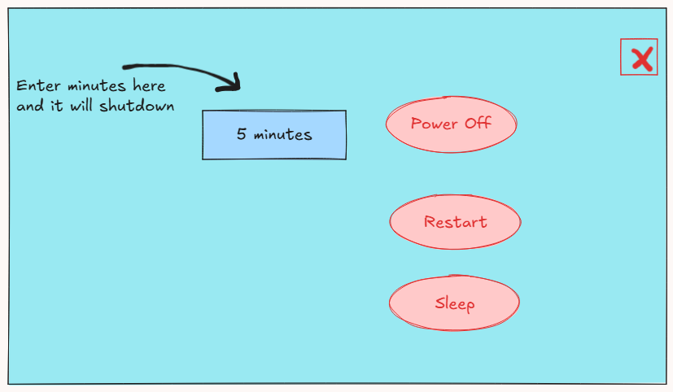
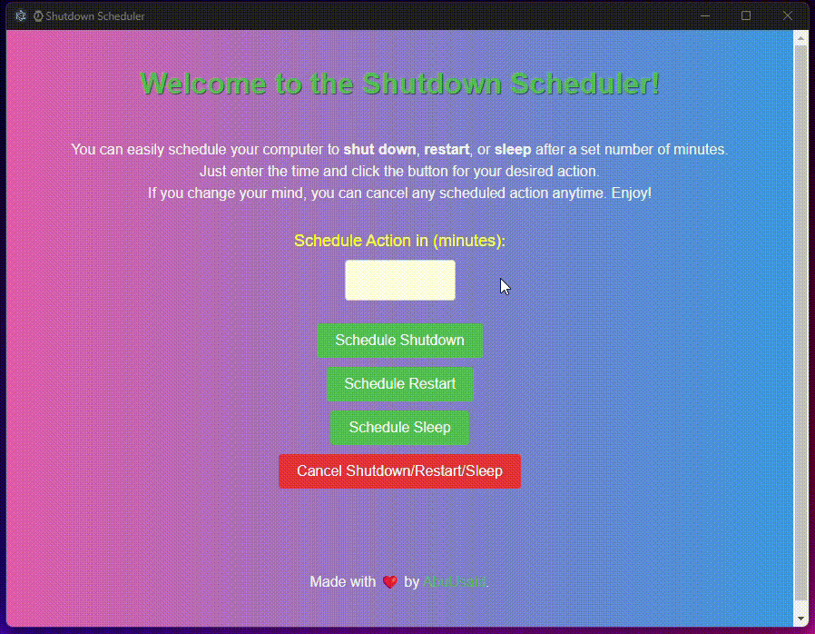

# Shutdown Scheduler

Electron.js application that allows users to schedule their computer to shut down, restart, or sleep after a specified number of minutes. The application provides an easy-to-use interface for scheduling actions and canceling them if needed.

## UI draft



## App in Action



## Features

- Schedule shutdown, restart, or sleep actions.
- Cancel any scheduled action at any time.
- User-friendly interface with a countdown timer.

## Technologies Used

- [Electron.js](https://www.electronjs.org/) - Framework for building cross-platform desktop applications.
- [Node.js](https://nodejs.org/) - JavaScript runtime for building server-side applications.

## Installation

1. Clone the repository:

   ```bash
   git clone https://github.com/YourUsername/YourRepositoryName.git
   ```

2. Navigate to the project directory:

   ```bash
   cd YourRepositoryName

   ```

3. Install the required dependencies:

   ```bash
   npm install

   ```

## Usage

1. **Start the application:**

   Open your terminal and run the following command:

   ```bash
   npm start

   ```

2. Enter the number of minutes you want to schedule the action in the input field.

3. Click on the desired action button (Schedule Shutdown, Schedule Restart, or Schedule Sleep).

4. If you change your mind, you can click the "Cancel Shutdown/Restart/Sleep" button to cancel any scheduled action.
